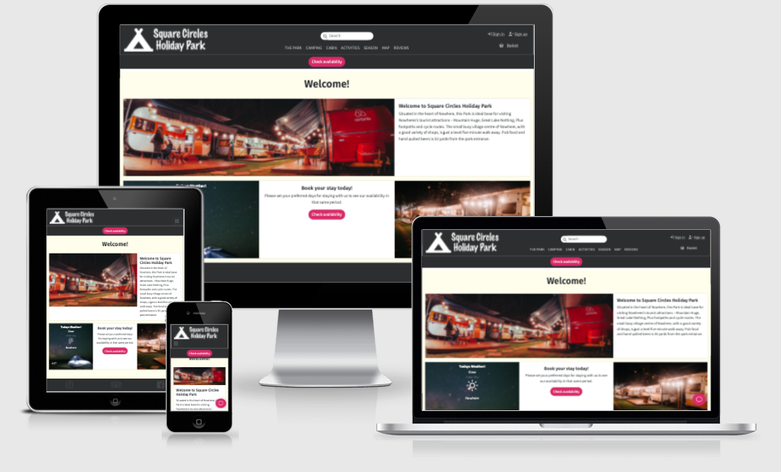

# Square Circle Holiday Park


[View the live project here.](https://square-circles.herokuapp.com/)

## Description

This is the main website for Square Circles Holiday Park. A facility hosting guests who needs a place to stay with their caravan, mobile home or tent. Square holiday park also facilitate cabins and activities.

The website is designed to be responsible and accessible on a range of devices, making it easy to navigate for potential campers and team members.



## Table of contents

- [Square Circle Holiday Park](#square-circle-holiday-park)
- [Description](#description)
- [Table of Contents](#table-of-contents)
- [User Experience (UX)](#user-experience-ux)
  - [User stories](#user-stories)
  - [Design](#design)
  - [Wireframes](#wireframes)
- [Features](#features)
- [Technologies Used](#technologies-used)
  - [Languages Used](#languages-used)
  - [Frameworks, Libraries & Programs Used](#frameworks-libraries--programs-used)
- [Data models](#data-models)
- [Testing](#testing)
  - [Testing User Stories from User Experience (UX) Section](#testing-user-stories-from-user-experience-ux-section)
  - [Further Testing](#further-testing)
  - [Known bugs](#known-bugs)
- [Deployment](#deployment)
- [Development](#development)
- [Credits](#credits)
  - [Code](#code)
  - [Content](#content)
  - [Media](#media)
  - [Acknowledgements](#acknowledgements)

## User Experience (UX)

[( Back to Top )](#table-of-contents)

### User stories

#### Viewing and Navigation goals

1. As a customer, I want to be able to view and list all products so that I can decide what to purchase.
2. As an customer, I want to be able to view the totals of my purchases so that I can spend a little more without over budget.
3. As a site user, I want to come in direct contact so I can ask any questions.
4. As a site user, I want to get an error message if the url is wrong, so I know that the page does not exists.
5. As a site user, I want to see the current weather so I know if I need to wear full jacket or shorts when visiting.
6. As a site user, I want to use a interactive map, so I can get an overview of the different pitches type.

#### Registration and user accounts goals

1. As an site user, I Want to be able to register for an account so that I can have a personal account and be able to view my details.
2. As an site user, I Want to be able to login and logout so that I can access my personal account information.
3. As an site user, I Want to be able to recover my password in case i forget it so that I can recover access to my account.
4. As an site user, I Want to be able to have a personalized user profile so I can view my personal order history and reservations.

#### Sorting and searching goals

1. As an site user, I Want to be able to list the products so that I can quickly identify the best priced product and identify the category.
2. As an site user, I Want to be able to sort the list of products so that I can quickly find what Im looking for.
3. As an site user, I Want to be able to search for a product by name or description so that I can find a specific product I'd like to purchase.
4. As an site user, I Want to be able to see what I've searched for and the number of results so I can quickly see whether the product I want is available.

#### Make Reservation goals

1. As a site user, I want to check for availability based on dates, so I know if I can purchase a reservation that fits in my calendar.

#### Purchasing and checkout goals

1. As a customer, I want to be able to schedule a reservation and put it into a basket.
2. As a customer, I want to be able to make purchases based on my basket items.

#### Review and rate goals

1. As a visitor, I want to review and rate the facilities so I can let others know what I think.

#### Site owner Administration goals

1. As a site owner, I want to be able to administrate the reservations.
2. As a cite owner, I want to be able to administrate the products the facilities has to offer.

### Design

#### Colour Scheme

Colors are selected with the help of the machine learning color generator [Huemint](https://huemint.com/about/)


#### Typography

Typography on the website is selected and combined based on the [deep learning project](https://github.com/Jack000/fontjoy) [fontjoy](https://fontjoy.com/).

- [Assistant](https://fonts.google.com/specimen/Assistant) is the main font used throughout the whole website.
- [Fira Sans](https://fonts.google.com/specimen/Fira+Sans) is used for headers.
- [PT Sans Caption](https://fonts.google.com/specimen/PT+Sans+Caption) is used for captions.

### Wireframes

All wireframes can be found in the [wireframes folder](wireframes). They are all organised with bootstraps style prefix and descriptive name.

- Home Page Wireframe - ([Large screen](wireframes/md_home.png)) ([small screen](wireframes/sm_home.png))
- Products Pages Wireframes - ([List of products](wireframes/md_products.png)) ([Single product](wireframes/md_product.png))
- Authentication Pages Wireframes - ([Profile](wireframes/md_my_profile.png)) ([Register](wireframes/md_register.png)) ([Sign in](wireframes/md_sign_in.png)) ([Password reset](wireframes/md_password_reset.png)) ([Change Password](wireframes/md_change_password.png))
- Basket & Checkout Pages Wireframes - ([Basket](wireframes/md_basket.png)) ([Checkout](wireframes/md_checkout.png)) ([Checkout Success](wireframes/md_checkout_success.png)) ([Availability popover](wireframes/md_availability_popover.png))
- Interactive Map Page Wireframe - ([Large screen](wireframes/md_map.png))
- Reviews Page Wireframe - ([Large screen](wireframes/md_reviews.png))

## Features

[( Back to Top )](#table-of-contents)

- Responsive on all device sizes
- Interactive elements
- User registration and accounts
- Sorting and searching
- Purchasing and checkout
- Check in
- Review
- Interactive map
- Display weather
- Site chat
- Customer Reviews

## Technologies Used

[( Back to Top )](#table-of-contents)

### Languages Used

- [HTML5](https://en.wikipedia.org/wiki/HTML5)
- [CSS3](https://en.wikipedia.org/wiki/Cascading_Style_Sheets)
- [Javascript](https://developer.mozilla.org/en-US/docs/Web/JavaScript)
- [Python](https://www.python.org/)

### Frameworks & Libraries

1. [Django](https://www.djangoproject.com/)
   - Django framework is used for this web app
1. [Bootstrap 5.1](https://getbootstrap.com/docs/5.1/getting-started/introduction/)
   - Bootstrap was used to assist with the responsiveness and styling of the website.
1. [Google Fonts](https://fonts.google.com/)
   - Google fonts were used to import fonts into the style.css file which is used on all pages throughout the project.
1. [Font Awesome](https://fontawesome.com/)
   - Font Awesome was used on all pages throughout the website to add icons for aesthetic and UX purposes.
1. [jQuery:](https://jquery.com/)
   - jQuery came with Bootstrap to make the navbar responsive but was also used for the smooth scroll function in JavaScript.
1. [django-storages](https://django-storages.readthedocs.io/en/latest/index.html)
   - USed as storage backend serving static files with aws S3.
1. [boto3](https://boto3.amazonaws.com/v1/documentation/api/latest/index.html#)
   - Used to create, configure, and manage AWS services.
1. [dj_database_url](https://pypi.org/project/dj-database-url/)
   - Used to connect to database
1. [psycopg2-binary](https://pypi.org/project/psycopg2-binary/)
   - Used as PostgreSQL database adapter
1. [small.chat](https://small.chat/)
   - small.chat is used tp create a on site chat button for site visitors to use
1. [Fontello](https://fontello.com/)
   - Fontello is used to generate missing icons needed.
1. [django-allauth](https://django-allauth.readthedocs.io/en/latest/installation.html)
   - used for user account authentication.
1. [django-crispy-forms](https://django-crispy-forms.readthedocs.io/en/latest/install.html)
   - Used to control the rendering behaviour of forms.
1. [Django-environ](https://pypi.org/project/python-environ/)
   - Used to handle environment variables.
1. [coverage](https://coverage.readthedocs.io/en/6.1.2/)
   - Used to measure code coverage tests
1. [dbdiagram.io](https://dbdiagram.io/home)
   - Used to draw Entity-Relationship Diagrams
1. [Stripe](https://stripe.com/)
   - Used to make card payments
1. [OpenWeather](https://openweathermap.org/)
   - API used to fetch weather
1. [open-weather-icons](https://github.com/isneezy/open-weather-icons)
   - font used to render weather icons
1. [unicorn](https://pypi.org/project/unicorn/)
   - Used as multi-platform, multi-architecture CPU emulator framework.
1. [daterangepicker](https://github.com/dangrossman/daterangepicker)
   - Used to pick dates.

### Programs & Tools Used

1. [Git](https://git-scm.com/)
   - Git was used for version control by utilizing the GitPod terminal to commit to Git and Push to GitHub.
1. [GitHub:](https://github.com/)
   - GitHub is used to store the projects code after being pushed from Git.
1. [Photoshop:](https://www.adobe.com/ie/products/photoshop.html)
   - Photoshop was used to create the logo, resizing images and editing photos for the website.
1. [Adobe XD:](https://www.adobe.com/products/xd.html)
   - Adobe XD was used to create the [wireframes](wireframes/) during the design process.
1. [Visual Studio Code:](https://code.visualstudio.com/)
   - Visual Studio Code was used as Integrated development environment (IDE).
1. [dbdiagram.io](https://dbdiagram.io/home)
   - Used to generate database overview image.
1. [ami.responsivedesign.is](http://ami.responsivedesign.is/)
   - Used to generate the site screenshot

## Data models

[( Back to Top )](#table-of-contents)

[PostgreSQL](https://docs.djangoproject.com/en/4.0/ref/databases/#postgresql-notes) is used to store all data in the production environment. It is also possible to disable production live database and use a local [SQLite](https://docs.djangoproject.com/en/4.0/ref/databases/#sqlite-notes) database instead by removing the .env variable `DATABASE_URL`.

### Data model overview


#### User Profile

User Profile holds user information.
Default data models from django-auth and django-allauth is also used to hold auth specific data.

| field                | type      | description        |
| -------------------- | --------- | ------------------ |
| \_id                 | pk        | unique record id   |
| user                 | fk        | category record id |
| default phone number | CharField | Holds product name |

#### Products

Products holds product name, price and image information.

| field       | type         | description               |
| ----------- | ------------ | ------------------------- |
| \_id        | pk           | unique record id          |
| category    | fk           | category record id        |
| name        | CharField    | Holds product name        |
| description | CharField    | Holds product description |
| price       | DecimalField | Holds product price       |
| image       | ImageField   | Holds product image       |

#### Categories

Categories holds Categories name information.

| field | type      | description         |
| ----- | --------- | ------------------- |
| \_id  | pk        | unique record id    |
| name  | CharField | Holds category name |

#### Pitch

Pitch holds Pitch information.

| field       | type      | description                    |
| ----------- | --------- | ------------------------------ |
| \_id        | pk        | unique record id               |
| product     | fk        | Holds product id               |
| name        | CharField | Holds pitch name               |
| description | CharField | Holds pitch description        |
| electric    | boolean   | Holds pitch electric state     |
| plug        | varchar   | Holds pitch electric plug type |
| graywaste   | boolean   | Holds pitch graywaste state    |
| fullwaste   | boolean   | Holds pitch fullwaste state    |
| water       | boolean   | Holds pitch water state        |
| tent        | boolean   | Holds pitch tent state         |
| seasonal    | boolean   | Holds pitch seasonal state     |

#### Order

Order holds every order made.

| field           | type          | description                  |
| --------------- | ------------- | ---------------------------- |
| \_id            | pk            | unique record id             |
| order_number    | CharField     | Holds order number           |
| user_profile    | fk            | User profile id              |
| full_name       | CharField     | User name                    |
| email           | EmailField    | User email                   |
| phone_number    | CharField     | User phone number            |
| date            | DateTimeField | Holds order date             |
| grand_total     | DecimalField  | Holds order grand total      |
| original_basket | TextField     | Holds the original basket    |
| stripe_pid      | CharField     | Holds the stripe purchase id |

#### Order Line Item

Order Line Item holds every line in each order made.

| field          | type          | description             |
| -------------- | ------------- | ----------------------- |
| \_id           | pk            | unique record id        |
| order          | fk            | Order id                |
| product        | fk            | Product id              |
| check_in       | DateTimeField | Check in date           |
| check_out      | DateTimeField | Check out date          |
| quantity       | integerField  | amount of pitches       |
| lineitem_total | DecimalField  | total value of lineitem |

## Testing

[( Back to Top )](#table-of-contents)

The W3C Markup Validator and W3C CSS Validator Services were used to validate every page of the project to ensure there were no syntax errors in the project.

- [W3C Markup Validator](https://validator.w3.org/) - Results ([Index Page](https://validator.w3.org/nu/?doc=https%3A%2F%2Fsquare-circles.herokuapp.com%2F)) ([Products Page](https://validator.w3.org/nu/?doc=https%3A%2F%2Fsquare-circles.herokuapp.com%2Fproducts%2F%3Fc%3Dcaravan%2520pitches%2Ctent%2520pitches%2Cmotorhome%2520parking)) ([Singe Product Page](https://validator.w3.org/nu/?doc=https%3A%2F%2Fsquare-circles.herokuapp.com%2Fproducts%2F1%2F)) ([Basket Page](https://validator.w3.org/nu/?doc=https%3A%2F%2Fsquare-circles.herokuapp.com%2Fbasket%2F)) ([Map Page](https://validator.w3.org/nu/?doc=https%3A%2F%2Fsquare-circles.herokuapp.com%2Fmap%2F))
- [W3C CSS Validator](https://jigsaw.w3.org/css-validator/#validate_by_input) - Results ([base.css](https://jigsaw.w3.org/css-validator/validator?uri=https%3A%2F%2Fsquare-circles.s3.amazonaws.com%2Fstatic%2Fcss%2Fbase.css&profile=css3svg&usermedium=all&warning=1&vextwarning=&lang=en)) ([home.css](https://jigsaw.w3.org/css-validator/validator?uri=https%3A%2F%2Fsquare-circles.s3.amazonaws.com%2Fstatic%2Fhome%2Fcss%2Fhome.css&profile=css3svg&usermedium=all&warning=1&vextwarning=&lang=en)) ([checkout.css](https://jigsaw.w3.org/css-validator/validator?uri=https%3A%2F%2Fsquare-circles.s3.amazonaws.com%2Fstatic%2Fcheckout%2Fcss%2Fcheckout.css&profile=css3svg&usermedium=all&warning=1&vextwarning=&lang=en)) ([pitches.css](https://jigsaw.w3.org/css-validator/validator?uri=https%3A%2F%2Fsquare-circles.s3.amazonaws.com%2Fstatic%2Fpitches%2Fcss%2Fpitches.css&profile=css3svg&usermedium=all&warning=1&vextwarning=&lang=sv))

[Coverage](https://coverage.readthedocs.io/en/6.1.2/) is used for testing and coverage report.

to run a test use the terminal command `coverage run manage.py test` in the root directory.

it's possible to generate a test with the terminal command `coverage html`, a folder named `coverage_html_report` is generated.

It's possible to read the report by opening the file `/coverage_html_report/index.html` in a browser.

### Test Report

Site is tested with this result.


### Testing User Stories from User Experience (UX) Section

#### Test Viewing and Navigation goals

1. As a customer, I want to be able to view and list all products so that I can decide what to purchase.
   1. Upon entering the site, users are greeted with a clean and easily readable navigation bar to go to the page of their choice.
2. As an customer, I want to be able to view the totals of my purchases so that I can spend a little more without over budget.
   1. In the navigation bar the user can navigate to the current basket where the total cost is displayed.
3. As a site user, I want to come in direct contact so I can ask any questions.
   1. On every page located in the bottom right of the current browser window there is a chat icon that can be pressed. By pressing the button a small chat window appears where the user can communicate the park site staff.
4. As a site user, I want to get an error message if the url is wrong, so I know that the page does not exists.
   1. if user navigates to a [faulty page](https://square-circles.herokuapp.com/nopagehere) a page not found message will automatically be visible.
5. As a site user, I want to see the current weather so I know if I need to wear full jacket or shorts when visiting.
   1. When entering the site the user can rad the current weather in the `today's weather`section.
6. As a site user, I want to use a interactive map, so I can get an overview of the different pitches type.
   1. In the sites navigation bar the user can select `MAP`.
   2. Above the interactive map the user can select parameters that will highlight the pitches with corresponding parameters.
   3. The site user can see the total of how many pitches have the current selected parameters updated automatically.
   4. It's possible for the site user to hover over each pitch to see details

#### Test Registration and user accounts goals

1. As an site user, I Want to be able to register for an account so that I can have a personal account and be able to view my details.
   1. As a first time visiting site user it is possible to select the sign up button found in the navigation bar.
   2. By filling out and submit the sign up form the user can be able to view future details.
2. As an site user, I Want to be able to login and logout so that I can access my personal account information.
   1. From the navigation bar it is possible to select sign in.
   2. By filling out and submit the required parameters user will be logged into the site
   3. The navigation bar now have a `My Page` option the user can select to access account information
   4. The navigation bar now also have the `sign out` option that can be selected.
   5. From the sign out page user can press the sign out button to fully logout.
3. As an site user, I Want to be able to recover my password in case i forget it so that I can recover access to my account.
   1. From the sign in page it is possible to select `forgot password`.
   2. In the password reset form it is possible to provide a valid email address and press the `Reset My Password` button.
   3. User will get an email containing a link to reset the password.
   4. Clicking the email link takes the user to the Password Reset Page, where a new password can be provided.
4. As an site user, I Want to be able to have a personalized user profile so I can view my personal order history and reservations.
   1. On site users `My Page` order history is available in a list format.
   2. by clicking a history order, user can view the order details.

#### Test Sorting and searching goals

1. As an site user, I Want to be able to list the products so that I can quickly identify the best priced product and identify the category.
   1. The site navigation bar contains the main products for the site user.
   2. Each navbar product item displays the categories found in the top of the products page.
2. As an site user, I Want to be able to sort the list of products so that I can quickly find what Im looking for.
   1. On products page there is a `Sort by` drop down button that can be used to sort the current list seen.
3. As an site user, I Want to be able to search for a product by name or description so that I can find a specific product I'd like to purchase.
   1. From the navbar it is possible to provide a search term and hit enter.
   2. All found products will be displayed.
   3. Title and description on each product will highlight the search term used.
4. As an site user, I Want to be able to see what I've searched for and the number of results so I can quickly see whether the product I want is available.
   1. in the top of the products page the number of found items is displayed.

#### test Purchasing and checkout goals

1. As a customer, I want to be able to schedule a reservation and put it into a basket.
   1. As a site user it is required to set the site users travel information by clicking the `Check availability` button in the navigation bar or any `Add to Basket` button.
   2. In the popover date picker it is possible to first click the arrival date and then departure date. After clicking apply the new travel information is set.
   3. Available products in the selected travel information period will print the amount available if any within the product details.
2. As a customer, I want to be able to make purchases based on my basket items.
   1. Site user can Add products into the basket.
   2. site user can select many equal products, if available on the same travel information dates selected.
   3. Site user can modify a product date range individually from the basket page.
   4. Site user can `Continue to Secure Checkout` and provide required information including card information to make reservation purchase.

#### Test Review and rate goals

1. As a site owner, I want to be able to administrate the reservations.
   1. ...
2. As a cite owner, I want to be able to administrate the products the facilities has to offer.
   1. ...

### Further Testing

- The Website was tested on Google Chrome, Microsoft Edge and Safari browsers.
- The website was viewed on a variety of devices such as Desktop, Laptop, iPhoneX.
- A large amount of testing was done to ensure that all pages were linking correctly.
- Friends and family members were asked to review the site and documentation to point out any bugs and/or user experience issues.

### Known Bugs

- On some mobile devices something is not perfect.
  - Something is slightly. wit
- ...
  - ...

## Deployment

[( Back to Top )](#table-of-contents)

The project was deployed to Heroku using the following steps...

1. [Sign up](https://signup.heroku.com/) or [sign in](https://id.heroku.com/login) at Heroku.
2. From your page, create new App with framework python.
3. Add on Heroku PostgrSQL Resource with the steps in [Database](#database) section.
4. Add static hosting with the steps in the [Static files](#static-files) section.
5. On Settings tab add all config vars from [.env.example](/.env.example), do not add variables in the `Development` section.
6. Connect Heroku to your github repo and do a manual deploy.
7. When deployment is done, navigate to the site url to test.

### Static files

The project uses [AWS S3](https://aws.amazon.com/s3/) bucket as cdn for static files served on [endpoint](http://cdn.square-circles.s3-website-eu-west-1.amazonaws.com/).

Full S3 documentation is available on [aws documentation website](https://docs.aws.amazon.com/AmazonS3/latest/userguide/Welcome.html)

After aws new user registration the following steps is needed at a glance.

1. create a new bucket and allow public access
2. activate static hosting on bucket
3. add a cors configuration that allows GET from any origin
4. Add a bucket policy that allows getObject on service S3 (remeber to add `/*` to the resource key for access to all objects within the bucket)
5. Set list objects allow for anyone.
6. Add group and user for the access from the project
7. add S3 full access to group and add bucket arn resource. (remember to add a list of resources where one resource list item is the bucket and the other item is all objects within the bucket)
8. download .csv file with user details and apply them to your .env file

#### cors configuration Example

```json
[
  {
    "AllowedHeaders": ["Authorization"],
    "AllowedMethods": ["GET"],
    "AllowedOrigins": ["*"],
    "ExposeHeaders": []
  }
]
```

### Database

This project uses Heroku postgressSQL.

1. in the heroku app add Heroku postgressSQL.
2. use the DATABASE_URL found in enviroment settings in Heruko in your .env file.
3. run `python3 manage.py migrate` to migrate the new database.
4. run `python manage.py loaddata initial_data` to load all fixtures
5. run `python3 manage.py createsuperuser` to create a superuser

### Add Screenshot to Readme

This site prevents clickbait and this results in services like [ami.responsivedesign.is](http://ami.responsivedesign.is/) can not display this site's content.

In order to create a screenshot of this site:

1. run this site in localhost
2. Add `@xframe_options_exempt` decorator above the view you would like to do a screenshot of.
3. in a browser navigate to [ami.responsivedesign.is](http://ami.responsivedesign.is/?url=http://localhost:8000)
4. Create screendump

#### View Example

```python
from django.views.decorators.clickjacking import xframe_options_exempt

@xframe_options_exempt
def index(request):
   # More code here...
```

## Development

[( Back to Top )](#table-of-contents)

It is advisable to use [virtual environments and packages](https://docs.python.org/3/tutorial/venv.html) with python application.
These guidelines includes help in add this project as a virtual environment in your local development setup.

### Perquisites

1. Confirm that python3 is installed by running `python3 --version` and confirm it's `Python 3.x.x` or higher.
1. Log in to GitHub and fork the [GitHub Square Circles Repository](https://github.com/malmgrenola/square-circles)
1. Click "Code" and the copy url button on your fork.
1. in a terminal run `git clone https://github.com/YOUR-GITHUB-NAME/square-circles.git` - to clone the repository to your local drive.
1. in a terminal run `cd square-circles` - to change directory to project root folder.
1. in a terminal run `python3 -m venv venv` - ta create a virtual environment.
1. in a terminal run `source venv/bin/activate` to activate the virtual environment.
1. in a terminal run `python3 -m pip install -r requirements.txt`
1. in a terminal run `python3 manage.py migrate && python3 manage.py createsuperuser` - to migrate the database and start the create superuser process.
1. answer the questions to create a superuser.
1. in a terminal run `python3 manage.py runserver` to start the server.
1. ...

Site is available on `http://localhost:8000`

Click [Here](https://help.github.com/en/github/creating-cloning-and-archiving-repositories/cloning-a-repository#cloning-a-repository-to-github-desktop) to retrieve pictures for some of the buttons and more detailed explanations of the above process.

### Stripe Webhooks

It is possible to setup your dev environment to handle the stripe webhooks. Full setup documentation can be found on [Stripe Docs - webhook-test-cli](https://stripe.com/docs/webhooks/test#webhook-test-cli)

1. install the Stripe CLI
1. in a terminal run `stripe login` to Link your Stripe account.
1. in a terminal run `stripe listen --forward-to localhost:8000/checkout/wh/`
1. copy the webhook signing secret printed in your terminal starting with `whsec_` to the `STRIPE_WH_SECRET` in your local `.env` file.
1. restart site (quit + `python3 manage.py runserver`)

### Development Cheat Sheet

- update env requirements: `pip freeze > requirements.txt`
- erase and clean app data: `python3 manage.py migrate <App> zero`
- Erase and clean database: `python3 manage.py flush`
- apply all app fixtures: `python manage.py loaddata initial_data`

## Credits

[( Back to Top )](#table-of-contents)

### Code

- [Bootstrap5](https://getbootstrap.com/docs/5.1/getting-started/introduction/): Bootstrap Library used throughout the project mainly to make site responsive using the Bootstrap Grid System.

- [MDN Web Docs](https://developer.mozilla.org/) : For Pattern Validation code. Code was modified to better fit my needs and to match an Irish phone number layout to ensure correct validation. Tutorial Found [Here](https://developer.mozilla.org/en-US/docs/Web/HTML/Element/input/tel#Pattern_validation)

- GitHub [gitignore Python](https://github.com/github/gitignore/blob/master/Python.gitignore) and [gitignore MacOS](https://github.com/github/gitignore/blob/master/Global/macOS.gitignore) : For basic gitignore patterns. gitignore is further modified to keep repo as clean as possible.

### Content

- All content was written by the developer.
- Psychological properties of colours text in the README.md was found [here](http://www.colour-affects.co.uk/psychological-properties-of-colours)
- reviews https://www.kaggle.com/andrewmvd/trip-advisor-hotel-reviews & https://www.kaggle.com/soumikrakshit/anime-faces & https://www.kaggle.com/nltkdata/names
- https://crownpointcampingarea.com/sitemap.html

https://crownpointcampingarea.com/PDF/CrownPointSiteMap_April2019_150_9.pdf
https://polladrasholidaypark.co.uk/seasonal-touring-pitches/

### Media

https://pikwizard.com/photo/blue-and-white-camping-tent-during-night-time/a1d82feb940d8d6fc8462233c328f5b2
https://www.pexels.com/sv-se/foto/man-bil-fordon-husvagn-753603/
https://www.pexels.com/sv-se/foto/ljus-semester-kvinna-kreativ-7510676/
https://www.pexels.com/sv-se/foto/kall-sno-tra-landskap-6367172/
https://www.pexels.com/sv-se/foto/sommar-metall-bil-fordon-8607100/
https://unsplash.com/photos/-Avc2AiE1_Q
https://pixabay.com/sv/photos/husvagn-camping-campingplats-vild-3132180/
https://www.pexels.com/sv-se/foto/tra-landskap-tradgard-trad-1144694/
https://www.pexels.com/sv-se/foto/sno-landskap-natur-himmel-1290877/
https://www.pexels.com/sv-se/foto/kall-sno-tra-ljus-3551230/
https://www.pexels.com/sv-se/foto/kall-sno-tra-landskap-749231/
https://www.pexels.com/sv-se/foto/natur-by-byggnad-konstruktion-4992384/
https://www.pexels.com/sv-se/foto/vag-skog-trad-cykel-100582/
https://www.pexels.com/sv-se/foto/arkitektur-bassangkant-hotell-simbassang-261327/
https://www.pexels.com/sv-se/foto/stad-himmel-byggnad-flicka-7514005/
https://www.pexels.com/sv-se/foto/kvinna-sitter-kraft-kondition-2475878/
https://www.pexels.com/sv-se/foto/hav-strand-havsstrand-camping-2582818/
https://www.pexels.com/sv-se/foto/landskap-natur-sommar-trad-2819554/
https://www.pexels.com/sv-se/foto/kall-sno-landskap-natur-950058/
https://www.pexels.com/sv-se/foto/dagsljus-farg-fargrik-hdr-206648/
https://www.pexels.com/sv-se/foto/natur-kvinna-trad-sitter-6861137/
https://www.pexels.com/sv-se/foto/ljus-semester-manniskor-kreativ-7510675/
https://www.pexels.com/sv-se/foto/ljus-semester-natt-mork-7510487/

https://realfavicongenerator.net/

### Acknowledgements

- https://stackoverflow.com/questions/2969348/django-ordering-numerical-value-with-order-by
- https://medium.com/python-pandemonium/how-to-test-your-imports-1461c1113be1
- https://stackoverflow.com/questions/1107737/numeric-for-loop-in-django-templates
